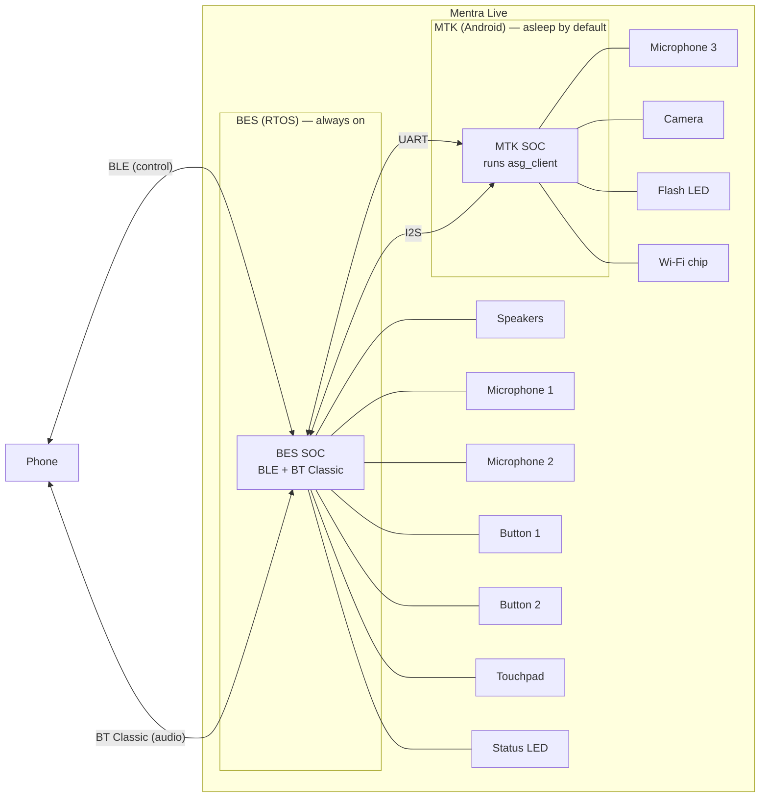

# Mentra asg_client

A MentraOS glasses client that runs on Android-based smart glasses such as Mentra Live.

### Compatible Devices

- Mentra Live

### Hardware Architecture (Mentra Live)

Mentra Live has two SOCs: an **MTK** chip running Android (where `asg_client` runs) and a **BES** chip running an RTOS. The BES owns the phone link and most peripherals; the MTK is asleep by default and is woken on demand for camera, Wi-Fi, and heavier compute. The two chips talk over **UART** (control) and **I2S** (audio).



Implications for development:

- The phone never talks to the MTK directly. All phone ↔ glasses traffic goes through BES, then over UART/I2S to the MTK when needed.
- Anything battery-cheap (button presses, touch input, status LED, the always-on audio path) lives on BES.
- Anything heavy (camera capture, RTMP streaming, Wi-Fi, on-device processing) requires waking the MTK.

### Environment Setup

1. Create a `.env` file by copying the provided example:

   ```
   cp .env.example .env
   ```

2. By default, the example contains production settings:

   ```
   MENTRAOS_HOST=api.mentra.glass
   MENTRAOS_PORT=443
   MENTRAOS_SECURE=true
   ```

3. Initialize the RTMP streaming library submodule (skip if you cloned with
   `--recurse-submodules`); from this `asg_client/` directory:
   ```
   git submodule update --init StreamPackLite
   ```

### Development on Mentra Live

Mentra Live ships with `com.mentra.asg_client` as a **system app** signed with Mentra's release key. To run your own build, `./scripts/dev-setup.sh` installs a fork alongside it under a separate package (`com.mentra.asg_client.thirdparty`), disables the stock app, and makes your build the default launcher; `./scripts/restore-stock.sh` reverses this.

### Phone App Compatibility

The MentraOS phone app must stay backward-compatible with older `asg_client` builds already in the field. When changing phone-to-glasses or glasses-to-phone protocol behavior, new phone app code should continue to accept old `asg_client` message shapes and unchunked responses.

The opposite direction is not a required compatibility target: a new `asg_client` build does not need to support older MentraOS phone apps. On startup, the phone app calls the cloud `GET /api/client/min-version` endpoint and compares its local app version with the cloud `required` and `recommended` versions. If the local app is below `required`, startup is blocked by the update flow instead of continuing into pairing or BLE use. Cloud V2 serves the values from `cloud-v2/packages/core/src/api/app.ts`, configured by `CLOUD_CLIENT_MIN_VERSION` and `CLOUD_CLIENT_RECOMMENDED_VERSION`; the mobile startup check is in `mobile/src/app/index.tsx`.

### Connecting via ADB

#### USB ADB

Snap the Infinity Cable onto the contacts on the right temple, plug the other end into your computer, then run `adb devices` to confirm. USB debugging ships enabled and authorized from the factory.

#### WiFi ADB

Find the glasses' Local IP Address in the MentraOS app (Glasses screen), then:

```bash
adb connect <GLASSES_IP>:5555
adb devices
```

### Installing Your Custom Build of asg_client

```bash
./scripts/dev-setup.sh
```

This script will:

1. Build your debug APK
2. Snapshot the latest staging OTA manifest and update stock ASG, BES, and MTK firmware
3. Disable the stock app and its recovery agents
4. Install your build as `com.mentra.asg_client.thirdparty`, grant its permissions, and make it the default launcher

Older Mentra Live firmware may need an explicit reboot after an MTK patch. If USB ADB has not
returned after 45 seconds, the script asks you to unplug and reconnect the Infinity Cable, then
continues automatically.

**Warning:** Your fork will not receive OTA updates from Mentra.

### Updating Mentra Live Firmware with a Custom Build Installed

After using `dev-setup.sh`, update the glasses firmware without rebuilding or reinstalling your
custom ASG Client:

```bash
./scripts/update-mentra-live.sh
```

The script preserves the third-party APK and its app data, updates the glasses with Mentra-signed
firmware, and returns to the existing third-party launcher after verifying the update. If the
update fails, it leaves the stock launcher active as a safe recovery path. See
[maintaining customized Mentra Live devices](docs/features/dev-firmware-update.md) for setup,
firmware update, reconnect, and recovery guidance.

### Restoring Stock Firmware

```bash
./scripts/restore-stock.sh
```

This removes your custom build and restores the factory app.

### Build Notes

Must use Java SDK 17. To set this, in Android Studio, go to Settings > Build, Execution, Deployment > Build Tools > Gradle, go to Gradle JDK and select version 17

### Documentation

See [docs/](docs/README.md) for architecture overview, command API reference, and feature docs.
